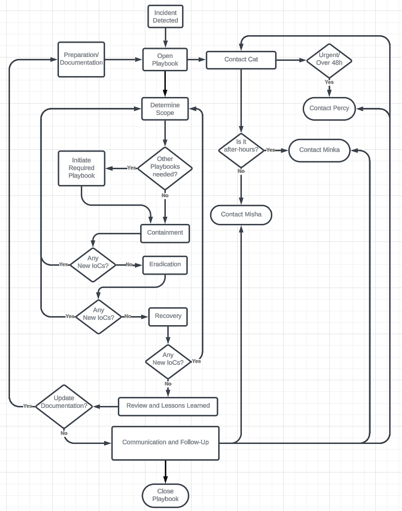

# Standard Operating Procedure (Playbook) for Cybersecurity Incident Response

## Table of Contents
- [Preparation](#1-preparation1)
- [Detection_and_Analysis:](#2-detection-and-analysis)
- [Containment_Eradication_and_Recovery:](#3-containment-eradication-and-recovery)
- [Post-Incident_Activity:](#4-post-incident-activity)
- [Close_the_Playbook_for_this_incident.](#close-the-playbook-for-this-incident)
- [Incident_Response_Flowchart](#incident-response-flowchart)
- [Sample Email Template_to_the_Client](#sample-letter-template-to-the-client-box-manufacturing)
- [Sample Email Template_to_the_MSSP](#sample-letter-template-to-the-third-party-provider-external-mssp--soc)
  - [Sample Email Sent at start of Incident](#this-email-sent-at-start-of-incident-shortly-after-playbook-opened)
  - [Sample Email Sent at start of Incident](#this-email-sent-at-start-of-incident-within-2-days-of-playbook-closure)
- [Citations](#citations)

## 1) Preparation[^1]:

- **Documentation and Contact Information:**
  - Ensure all relevant contact information is up-to-date and readily accessible.
  - Maintain a list of primary and alternate contacts including:
    - Box Manufacturing:
      - Percy (percy@***)
      - Misha (mesha@***, Phone: *** *** ****)
      - Minka (minka@***, Phone: *** *** ****)
    - External MSSP & SOC Security Oversight:
      - Cat (cat@***, Phone: *** *** **** or Cell: *** *** ****)

**Escalation Procedures:**

- Define escalation criteria for incidents requiring urgent attention.
- Percy to be informed personally if:
  - Incident is escalated or urgent.
  - Incident remains unresolved after 48 hours.
- During Office Hours (9AM to 5PM AST weekdays):
  - Cat (cat@***, Phone: *** *** **** or Cell: *** *** ****)
  - Notify Misha (misha@***, Phone: 902 66-9999) for any urgent incidents.
- After Office Hours and Weekends:
  - Cat (cat@***, Phone: *** *** **** or Cell: *** *** ****)
  - Notify Minka (minka@***, Phone: *** *** ****) as the alternate contact.


- **Playbook Access:**
  - Ensure Cat has access to all relevant playbooks and workflows for incident response.

## 2) Detection and Analysis:

- **Initial Detection:**
  - SOC monitors network, systems, and data for any suspicious activity.
  - Upon detection, SOC initiates incident response process.

- **Initial Assessment:**
  - SOC performs preliminary analysis to determine the nature and severity of the incident.
  - If necessary, refer to specific incident playbooks for detailed procedures (e.g., ransomware, malware, phishing, etc.).

**Triggers:**
- Alerts from intrusion detection systems.
- Unusual outbound network connections.
- Anomalies in user behavior.
- Confirmation of unauthorized access.
- Identification of malicious software.
- Data encryption or deletion.

## 3) Containment, Eradication and Recovery:

- **Containment:**
  - SOC takes immediate steps to contain the incident and prevent further damage.
  - Collect and preserve data.
  - Perform Technical analysis.
  - Follow predefined containment procedures as outlined in relevant playbooks.
  - If any new IoC, Procede to contain those assets.
  - Once conatinment is complete, procede to eradication.

- **Eradication:**
  - SOC works towards removing the threat from the network and systems.
  - Implement eradication procedures as per established playbooks.
  - Once eradicaiton is complete, procede to recovery.

- **Recovery:**
  - SOC initiates recovery efforts to restore affected systems and data.
  - Refer to relevant playbooks for step-by-step recovery processes.
  - If any other incidents are discovered during this process, relevant incident playbooks are to be initiated.


## 4) Post-Incident Activity:

- **Documentation and Reporting:**
  - SOC thoroughly documents all actions taken during the incident response process.
  - Prepare incident report detailing:
    - Incident timeline
    - Actions taken
    - Impact assessment
    - Recommendations for future prevention

- **Review and Lessons Learned:**
  - Conduct a post-incident review to analyze the effectiveness of the response.
  - Identify lessons learned and areas for improvement.
  - Update playbooks and workflows based on insights gained from the incident.

- **Communication and Follow-Up:**
  - Communicate incident resolution and any follow-up actions required to Cat.
  - Ensure Cat approves all playbooks and workflows developed or updated during the incident response process.
  
## Close the Playbook for this incident.

## Incident Response Flowchart

[^2][^3]


### Sample Letter Template to the Client (Box Manufacturing):

```
Subject: Security Incident Notification

Dear <clent( Percy/Misha/Minka )>,

My name is Jim from the Sercurity Operations Centre. I hope this message finds you well. We wanted to inform you of a recent security incident detected within the Box Manufacturing network.

Description of Incident:
[Here would be a very brief description of the incident, including severity level, impact, and current status.]

Actions Taken:
[Here, we would include a general outline the steps taken by the SOC and our team to investigate and remediate the incident.]

Next Steps:
[And here any further actions required and expected timelines for resolution wqould be detailed]

We will continue to keep you updated on the progress and appreciate your attention to this matter.

Best regards,
Jim
SOC Analysy
jim@***
```

### Sample Letter Template to the Third-Party Provider (External MSSP & SOC):

#### This email sent at start of incident shortly after playbook opened.

```
Subject: Security Incident at Box Manufaturing Network

Dear Cat,

I hope this message finds you well.

My name is Jim from the security Operations Centre. I would like to inform you of an Indication of Compromise on the Box Manufacturing network.

Description of IoC:
[Here I would provide a detailed description of Indicator of Compromise and the fact that we've opened a playbook. We would then invite her to join our effors in dealing with it.]

Best regards,
Jim,
SOC Analyst
jim@***
```

#### This email sent at start of incident within 2 days of Playbook closure.

```
Subject: Security Incident Response Collaboration

Dear Cat,

I hope this message finds you well.

My name is Jim from the security Operations Centre. I would like to persoinally thank you for your invaluable input and insightful collaboration in dealing with the recent incident at the Box Manufacturing network.  You were invaluable in mitigating the impact of this incident. We appreciate your continued support in ensuring the security and resilience of their network.

Description of IoC:
[Here I would provide a detailed description of the Incident. I would include liks to the MITRE ATT&CK site as well as details regarding the findings of the incident (things like the type of attack, what variants were discorvered). I would also inform Cat of any other incidents were discovered during the process of working throughb the main incident. I would also include any lessons we have learned and how we could mitigate or prevent the incident from occuring agan in the future.]

We will be updating our playbooks to include all the infomration that we learned from this incident and will be forwarding them to you for approval in due course.

Once again, thank you for your help! I hope that you're having a great day!

Best regards,
Jim,
SOC Analyst
jim@***
```

## Citations

[^1]: [NIST Incident Response Framework](https://www.techtarget.com/searchsecurity/tip/Incident-response-frameworks-for-enterprise-security-teams). This was used as the overarching framework to determine the four phases of the Incident Response Cycle.
[^2]: [Lucid Flowchart creator](https://lucid.app/). Used to create the flowchart.
[^3]: [Cybersecurity Incident and Vulnerability Response Playbooks](https://www.cisa.gov/sites/default/files/publications/Federal_Government_Cybersecurity_Incident_and_Vulnerability_Response_Playbooks_508C.pdf). Used as inspiration while drawing up the flowchart for this specific scenario.
[^4]: [Computer Security Handling Guide](https://nvlpubs.nist.gov/nistpubs/specialpublications/nist.sp.800-61r2.pdf). Page 22 (Section 3.1.1) - Information to include in Preparation section
